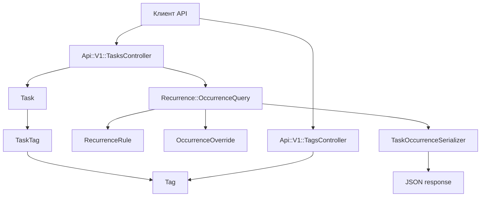

# Api Tracker

Rails API для трекера рабочих задач медицинского персонала.

## Стек

- Ruby 3.4.4
- Rails 8 API
- PostgreSQL 16
- RSpec
- Docker Compose

## Быстрый запуск

```bash
docker compose up --build
```

API будет доступно на `http://localhost:3000`.

Подготовка базы и тесты:

```bash
docker compose run --rm -e RAILS_ENV=test -e DATABASE_URL=postgres://api_tracker:api_tracker@db:5432/api_tracker_test api bash -lc "bin/rails db:prepare && bin/rspec"
```

Seed добавляет обязательные теги:

- `отчетность`
- `операции`
- `звонок`

Эти теги помечены как `locked` и не могут быть изменены или удалены.

## Документация API

Swagger/OpenAPI спецификация лежит в [docs/openapi.yaml](/Users/solofmeister/Api-tracker/docs/openapi.yaml).

Основные endpoints:

- `GET /api/v1/tasks?from=2026-06-01&to=2026-06-30&status[]=pending`
- `POST /api/v1/tasks`
- `GET /api/v1/tasks/:id`
- `PATCH /api/v1/tasks/:id`
- `DELETE /api/v1/tasks/:id`
- `PATCH /api/v1/tasks/:task_id/occurrences/:date`
- `GET /api/v1/tags`
- `POST /api/v1/tasks/:id/tags/:tag_id`
- `DELETE /api/v1/tasks/:id/tags/:tag_id`

## Архитектурные решения

Повторяющиеся задачи не материализуются на годы вперед. В базе хранится базовая задача и правило повторяемости, а список API строит виртуальные occurrence только для запрошенного окна дат. По умолчанию окно равно 30 дням, максимальное окно ограничено 366 днями.

Статус конкретного выпадения периодической задачи хранится в `occurrence_overrides`. Поэтому отметка `done` за сегодня не влияет на вчерашнее или завтрашнее выпадение.

Для бонусного сценария "отрыва" экземпляра от серии в `occurrence_overrides` предусмотрены поля `title`, `description`, `due_time` и `cancelled`.

## Повторяемость

Поддерживаются типы:

- `daily`: каждый `n`-й день от `starts_on`;
- `monthly_day`: конкретное число месяца от 1 до 31, невозможные даты пропускаются;
- `specific_dates`: только явно заданные даты;
- `day_parity`: четные или нечетные дни месяца.

## Диаграмма работы сервиса



## Пример создания периодической задачи

```bash
curl -X POST http://localhost:3000/api/v1/tasks \
  -H "Content-Type: application/json" \
  -d '{
    "task": {
      "title": "Ежедневный обход",
      "description": "Проверить состояние пациентов",
      "due_date": "2026-06-01",
      "recurrence_rule_attributes": {
        "recurrence_type": "daily",
        "interval": 1,
        "starts_on": "2026-06-01"
      }
    }
  }'
```
